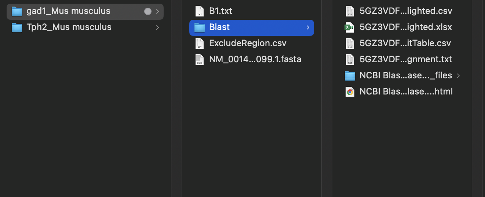

# In situ HCR_Probe_Design_ver2

## Introduction
This program is version 2 of the probe design script used for the whole brain in situ hybridization method (Kanatani S et al., biorxiv, 2022). It has a more convenient probe design workflow than version 1.  

The overall workflow of the script is
1.	Obtain reference sequence from NCBI
2.	Perform BLAST and remove similar sequences
3.	Run the script here to have probe sequences

Here, we show the practical example of how to use this script below using a mouse Gad1 and Tph2 mRNA. (The example was done on 2024-May-30)

## Example 

### 1. Obtain reference sequence from NCBI

- Visit NCBI Gene page and search the reference sequences of your target mRNAs.  
   - https://www.ncbi.nlm.nih.gov/gene
   - select 'nucleotide' in the dropdown menu to give the raw sequence data for the transcript, including variants. The sequences can also be obtained using the 'gene' search, but this result gives a more broad overview of the gene function.
 

- Download the FASTA sequences of your targets. The followings are the example of Gad1 and Tph2 from mouse (Mus musculus).

- Make a folder structure as below and save the FASTA sequence(.fasta).
   - Main folder: Gene_name_organism
   - Save the fasta file with the corresponding accession ID ended in .fasta
   - Subfolder: Blast
    
#### Mouse Gad1 gene 
It had 10 isoform at mRNA level. Here we picked the longest one which was 
mRNA reference sequence NM_001420099, 3561 bp

https://www.ncbi.nlm.nih.gov/nuccore/NM_001420099.1

FASTA sequence:

>NM_001420099.1 Mus musculus glutamate decarboxylase 1 (Gad1), transcript variant 3, mRNA
 CTTCTTCAGGCTCTCCCGTGCCGGACCAGGGATCGTGCAAGCAAGGAAGCAGCCCTGGGGTGACACCCAG
 CACGTACTCCTGTGACAGAGCCGAGCCCAGCCCAGCCCCGGGACGCTTCGCAGAGGAGTCGCGGGAGGGT
 CCAGCTCGCTGTCGCTGAACCGAGGTGGGTAAATACCGGATCGCCCGGACTTGCCAGAGCCCCGCCTCGG
 TTATTCAACCCGGTGCCCTCAGCCTGCGGCTTCTTGTCCAGCCCTTTGCCTCACCCCACCAGCACGCGCC
 TGTCGCCCACCTTCCACAGCCGAGTGCTTCCCGCCAGTCCTGTCGCAGCTGTGGTTTGGCGCACCCATCC
 CCTACCCTCCTCGCTCTTGAAACCCTTATCAATTTCATTCGGGAGGACACATAAGGGCTGAAGTGACCCC
 AGAGCCATTTTTTGCCTGCGCTTGGGGGATCGGAGCTCACGGCTGTCGGATACGCGCCTGGGTAGCAGCG
 GCAGAAGCCTGTTCCTGCGCCCAGTCTGCGGGGGACCCTTGAACCGTAGAGACCCCAAGACCACCGAGCT
 GATGGCATCTTCCACTCCTTCGCCTGCAACCTCCTCGAACGCGGGAGCGGATCCTAATACTACCAACCTG
 CGCCCTACAACGTATGATACTTGGTGTGGCGTAGCCCATGGATGCACCAGAAAACTGGGCCTGAAGATCT
 GTGGCTTCTTACAAAGGACCAATAGCCTGGAAGAGAAGAGTCGTCTTGTGAGCGCCTTCAGGGAGAGGCA
 GTCCTCCAAGAACCTGCTTTCCTGTGAAAACAGTGACCAGGGTGCCCGCTTCCGGCGCACAGAGACCGAC
 TTCTCCAACCTGTTTGCTCAAGATCTGCTTCCAGCTAAGAACGGGGAGGAGCAAACTGCGCAGTTCTTGC
 TGGAAGTGGTAGACATACTCCTCAACTATGTCCGCAAGACATTTGATCGCTCCACCAAGGTTCTGGATTT
 CCACCACCCACACCAGTTGCTGGAAGGCATGGAAGGCTTTAATTTGGAGCTGTCTGACCACCCCGAGTCT
 CTGGAGCAGATCCTGGTTGACTGTAGAGACACCCTGAAGTACGGGGTTCGCACAGGTCACCCTCGATTTT
 TCAACCAGCTCTCTACTGGTTTGGATATCATTGGTTTAGCTGGTGAATGGCTGACATCGACTGCCAATAC
 CAATATGTTCACATATGAAATTGCACCCGTGTTTGTTCTCATGGAACAGATTACTCTTAAGAAGATGAGA
 GAGATCGTTGGATGGTCAAATAAAGATGGTGATGGGATATTTTCTCCTGGGGGAGCCATATCCAATATGT
 ACAGCATCATGGCTGCTCGTTACAAGTACTTCCCAGAAGTGAAGACAAAAGGCATGGCGGCTGTGCCCAA
 ACTGGTCCTCTTCACCTCAGAACACAGTCACTATTCCATAAAGAAAGCCGGGGCTGCGCTTGGCTTTGGA
 ACCGACAATGTGATTTTGATAAAGTGCAATGAAAGGGGGAAGATAATTCCGGCTGATTTAGAGGCAAAAA
 TTCTTGATGCCAAACAAAAGGGCTATGTTCCCCTTTATGTCAATGCAACCGCAGGCACGACTGTTTACGG
 AGCATTCGATCCAATCCAGGAAATTGCGGACATATGTGAGAAATACAACCTTTGGCTGCATGTGGATGCT
 GCCTGGGGTGGTGGACTGCTCATGTCCCGGAAGCACCGCCACAAACTCAGCGGCATAGAAAGGGCCAATT
 CAGTCACCTGGAACCCTCACAAGATGATGGGCGTGCTGCTCCAGTGCTCTGCCATTCTGGTCAAGGAAAA
 GGGTATACTCCAAGGATGCAACCAGATGTGTGCAGGCTACCTCTTCCAGCCAGACAAGCAGTATGACGTC
 TCCTATGACACCGGGGACAAGGCGATTCAGTGTGGCCGCCATGTGGACATCTTCAAGTTCTGGCTGATGT
 GGAAAGCAAAGGGCACCGTGGGATTTGAAAACCAGATCAACAAATGCCTGGAGCTGGCTGATTACCTCTA
 CGCCAAGATTAAAAACAGAGAAGAGTTTGAGATGGTTTTCGATGGTGAGCCTGAGCACACAAATGTCTGT
 TTCTGGTACATTCCACAAAGCCTTCGAGGGGTTCCAGATAGCCCTGAGCGACGAGAAAAGCTACACAGGG
 TGGCTCCCAAGATCAAAGCTCTGATGATGGAGTCAGGAACAACCATGGTGGGCTACCAGCCTCAAGGGGA
 CAAGGCCAACTTCTTCCGGATGGTCATCTCTAACCCAGCCGCCACCCAGTCTGACATCGATTTCCTCATT
 GAGGAGATAGAGAGGTTGGGTCAGGATCTGTAATCCCTCTTTACAGAACCAGAATCATCGGCCATGCTTG
 TGCCCCTCTGGTACCCTAGAGCACAGCTCTGTCAGTAGCTGACACATCTAGGCCATCTCACTGAAGGAAA
 TTACAATCTCTTAAAGAATATTTGTCACATTTCACATAAGCTTGTTTGTTAGAGCTAGTGGGGAAATAAT
 GTTCTTTTTAAAAAATTGCACATTAGAAACACAGTATATATGTACAGTTATATATACCTCTCTCTATGTA
 CATGTATGTATAGTGACTGTGGCTTAGTCCTAGACCATAGCATGTTGCTCGTCCCCAGGAAATTAGCCTT
 ACCCCCAGCAATTACTAAGAGGCTAAACCATCTCGCAAGCAACTACAGGGCGGATGGTATCCCTACTGCA
 GTGTCCTAGGGACCCAGGGAAAGGCTGTTGGTGGGAGGCTACCTCCCTGCTAGAGCTGTTCCCACGTGAA
 GGGATGATGGATGACAGATGTACCAGTAAATGACAAATGTCACACCCTCCCTGTTAGTACCCTGCTAGGG
 GAAATAGTAGCAGTCTTTGTCACAATTGTGCTTTGCTGTGTTTTAGAGATTAATCTGTGTAAACTGTGTA
 CATTGCCATTGTCTATCTTTGGGCAGGGGGAAGTGCATATAATGATTAAATTGTATGTCAGTGAGATATC
 TGCTTATTTATATTCAAATATATACCATGTTAAAGAGACATCTTGTATTTTCTTCCCATTTGTAATGTAT
 CTTATTTATATATTAATGGAGTAAGTTCTGGATACTGTTTATGGTATTTTCGTGCATTTGTGAGCCAAAG
 AGAAAAGATGAAAATTAGTGAGATTTGCATTTATATTAGAGTGCCCTTAACATAATGATTTGAACATATG
 TGTACTGTCTGGAAAAGAATTCTGATACTGTACATAGAGTCATGTTATGGAAATCTTGCTTCAGTAGCCT
 TCGCTCTTCTCTTTCCCCCCTCAGGCTGTATGTCAGATGTTCTCAAAGCTTTTCTAGTAACTGTTGAATA
 ATAATAACTAGATCTCCTGTAATTTTGTAGTAGTATATGACCAATCTCTGTGACTCGCTTAGCTGAAACC
 TAAGGCAATGTTTCTGAAGACCTCCGATACACTGACCAGTCCCACAAGTGTTTTTGAAGACATGAAACCC
 ACACTGTGCATTTAGGGTGTGCAAGAAGAATATAAATAAAATAAAAAATATTCTCCATGAA'

#### Mouse Tph2 gene  
mRNA reference sequence NM_173391.3, 2626 bp

https://www.ncbi.nlm.nih.gov/nuccore/NM_173391.3

FASTA sequence:

>NM_173391.3 Mus musculus tryptophan hydroxylase 2 (Tph2), mRNA
CACTGCTCTTCAGCACCAGGGTTCTGGACAGCGCCCCGAGCAGGCAGCTGCCACTGCAGTTCCTCCTTCA
TCTCTGCCAAGGCCGCCCCTCTGGTCCCCCCTGCTGCTGAGAAAGAAAATTACATCGGGAGCCATGCAGC
CCGCAATGATGATGTTTTCCAGTAAATACTGGGCCAGGAGAGGGTTGTCCTTGGATTCTGCTGTGCCAGA
AGATCATCAGCTACTTGGCAGCTTAACACAAAATAAGGCTATCAAAAGCGAGGACAAGAAAAGCGGCAAA
GAGCCCGGCAAAGGCGACACCACAGAGAGCAGCAAGACAGCGGTAGTGTTCTCCTTGAAGAATGAAGTTG
GTGGGCTGGTGAAAGCACTTAGACTATTCCAGGAAAAACATGTCAACATGCTTCATATCGAATCCAGGAG
GTCCCGACGAAGAAGTTCTGAAGTCGAAATCTTCGTGGACTGCGAATGTGGCAAAACGGAATTCAATGAG
CTCATCCAGTTGCTGAAATTTCAGACCACCATTGTGACCCTGAATCCGCCTGAGAGCATTTGGACGGAGG
AAGAAGATCTCGAGGATGTGCCGTGGTTCCCTCGGAAGATCTCTGAGTTAGACAGATGCTCTCACCGAGT
CCTCATGTACGGCACCGAGCTTGATGCCGACCATCCAGGATTTAAGGACAATGTCTATCGACAGAGGAGG
AAGTATTTTGTGGATGTGGCCATGGGCTATAAATATGGTCAGCCCATTCCCAGGGTCGAGTACACAGAAG
AAGAGACTAAAACTTGGGGTGTTGTGTTCCGGGAGCTCTCCAAACTCTACCCGACTCATGCTTGCCGGGA
GTACCTGAAAAACCTCCCCCTGCTGACCAAGTACTGTGGCTACAGGGAAGACAACGTGCCGCAACTGGAA
GACGTCTCCATGTTTCTGAAAGAGCGATCTGGCTTCACAGTGAGACCAGTGGCTGGCTACCTGAGCCCAA
GAGACTTCCTGGCGGGCCTGGCCTACAGAGTATTCCACTGCACCCAGTACGTGCGGCATGGCTCCGACCC
CCTCTACACCCCGGAACCAGATACATGCCATGAACTCTTGGGACACGTGCCACTGCTTGCGGATCCCAAG
TTTGCTCAGTTTTCCCAAGAGATAGGCTTAGCGTCTCTGGGAGCCTCAGATGAGGACGTTCAGAAACTAG
CCACGTGCTATTTCTTCACAATCGAGTTCGGCCTTTGCAAGCAAGAGGGTCAACTGCGGGCGTATGGAGC
AGGGTTACTTTCGTCCATCGGAGAATTGAAGCATGCTCTTTCCGACAAGGCGTGTGTGAAATCCTTTGAC
CCAAAGACGACCTGCTTGCAGGAATGCCTAATCACCACCTTTCAGGACGCTTACTTTGTTTCGGACAGTT
TTGAAGAAGCCAAAGAAAAGATGAGGGACTTTGCAAAGTCAATTACCCGTCCCTTCTCGGTATACTTCAA
CCCCTACACGCAGAGCATTGAAATTCTGAAAGACACCAGAAGTATTGAGAATGTGGTGCAGGACCTGCGC
AGTGATTTGAACACAGTGTGTGATGCCTTGAATAAAATGAACCAATATCTGGGGATTTGATGCCTAGAAC
CAGAGTTATTGTCAGCATGAGCTCTTGGGGGGTGTAGCAACAATGCAGTCAATGTTATCCAACATCAACA
ACTTTCTGTGTCATGGTTGGCTAGTAAGCATGCAATTCTGTATGTCCATACCTCTGTGTAACTTAATAAC
ACAAAAATGCTCTAAAGAACCCATGCAGATAACCACTCACCATTTGAAAGATTGTGATCCTATTTGGACA
TCTCAAGTAGAGTTGACATTTCTGATTAGCGAACAAACTGTTAACTTAAGCAAACTGTGACTTTGAAATC
TGTAGCAAACATTCCTCGCACAATTCCAGTCGGTGAGTTGTGGAACTTTTCTTCCTTGGACCTGAGACTT
TCCTCTGTGTTCATTAGATAAAATGAAAATAGTTGGGAGGTGGTTTCTATTTTCAATAGTATCCGTGTTA
TTTGAGATAAACTAGAGTTGCTCCACGCTTTGCATCACAGCAACAAAGGATTTAATATTCTACTTCAGAA
GCTGTTCAGAAACACAGCAGTTGGGATGGATGTAGACTGAGTGTTCAGACAATGCAAGCAAAGAAAAGTT
TTGATAAACAGGATATATAGGTTGTACTGACCTCGTTGAAACCAATTTGTGGCAAGCTTCCTGAAGAGCT
TCTGGAAGGAAACACTTGAACAAAGAATATTCGGGAAGCTTAAACAGAAGGGATGAAAATCTTGGAACTG
TGAATGTATTGTTAGGATAGAGTGAATTATCACTGCAGGCTTTTGACTCCTTTTGCTTAGACTGAGAACC
TCAAATCCCACAGGGATGTAAATACCATCTCTGATTCCAAAGAGTTGGAGACGGAGTCGTAGAGAAACAA
AGGGATTTGCTTCAGTTAGGTCTGATGAGATGTGCCATGGTCATAAGCCACTGCCCTTTTATGTTGGACA
TCTGACAAGTCTACTGTAGTGTACATGCATGTTTATGTATTGACACAGAAAGAAAATTATTGCTTATAAA
ATGAATGCTTCTCAATAAACAGAATCTTGCCCCCAA

### 2. Perform BLAST sequence similarity check

Here, we run BLAST using the FASTA sequence downloaded. The following steps are described below.
- Run Blast
- Download results
- Extract the sequence regions excluded for probe design

#### Run Blast
- Go to NCBI Blast home page: https://blast.ncbi.nlm.nih.gov/Blast.cgi  
- Scroll down to the section for "BLAST Genomes" and type the organism which you are interested in (in this case it is Mus musculus (Mouse).  
- After typing the Mouse, another webpage opens which brings you to the blast webpage:  
- https://blast.ncbi.nlm.nih.gov/Blast.cgi?PAGE_TYPE=BlastSearch&BLAST_SPEC=OGP__10090__9559&LINK_LOC=blasthome  
- Paste a fasta sequence that you obtained from step 1 in "Enter Query Sequence" section.  
   - Then, under the "Choose Search Set" -> Database tab, choose RefSeq RNA.  
   - Under the "Program Selection" tab, choose "Somewhat similar sequences (blastn)" algorithm.  
   - Optional: you can mark on "Show results in a new window". This opens your blast results in another window.  
- Other settings are default

### Download results

- From "Alignments" tab, click on Download on the right corner of the window and download hit table files both in txt and csv in sub-folder Blast (see folder structure in step No.1). Also save the entire web page as html file for the record in that folder.

### Extract the sequence regions excluded for probe design

Here, we specify the regions that are excluded from probe design due to similarity:
   
- In the HTML file or blast result, check the column specifies the percent identity and look down and find the rows that are below 100%:
   

- In the csv file downloaded earlier, highlight the corresponding regions of the query transcript that show allignment (columns G and H in the csv file). These are the regions we want to exclude from being targeted during probe design, to prevent non-specific probe binding.
- For good record keeping, save this highlighted file within the Blast folder as an xls file and a txt file. 
- Confirm which transcript sequences you want to remove (columns G and H) 
- Copy and paste this region into another Excel sheet and save it in the csv file in the main folder with ExcludeRegion.csv (step 1).   
- The ExcludeRegion.csv file should look like this:
   

- Specify the hairpin type by making an Excel sheet having e.g. B1, and then save the file in txt format with the name of B((number from 1 to 5)).txt as shown in the image below.
   

- The final folder structure should look like this:

- NOTE: in MacOS the csv file from the Hit Allignment may open incorrectly in Excel - where the columns are not separated. In this case, select column A and go to data > text to columns > Delimited > comma > general > finish. This should open the data in the correct format, but check the formatting is as you expect.
- NOTE: when choosing the RefSeq transcript, mutliple results may come up for a particular transcript, that differ in annotation status. A transcript that begins with the  "NM_" prefix indicates that it has been reviewed and is well-supported by experimental data. A transcript that begins with the "XM_" prefix is a computationally predicted variant based on genomic data but has not been experimentally confirmed. Therefore, always choose the "NM" transcript if available. This means that "XM" predicted variants of the transcripts may have longer sequences and therefore less than 100% identity with the query transcript, but these regions of allignment should not be excluded from probe design. Therefore, when downloading the Hit Allignment file, it is best to deselect these transcripts, as shown:

## 3. Run the script here to have probe sequences

1. Download the zipped file from this repository
 

2. Open zipped file in matlab

 

3. Click on probe_design_main_Github.m. This will open the main script in the editor.

   
4. In the command window, assign the input and output files
   
The input file is the final folder structure created above.   This should be assigned to the variable FASTA_dir like this `FASTA_dir = 'file_path'; % Replace 'file_path' with the actual path`

The output file is the file you want the results to be stored in.   This should be created on your desktop, and assigned to the variable out_dir like this `out_dir = 'file_path'; % Replace 'file_path' with the actual path`

Ensure the variables are correctly assigned by checking the workspace.

5. Copy the code line `probe_design_main_Github(FASTA_dir, out_dir)` from the editor to the command window. Press enter, and the code will run.
   
6. Check the output file, the output files should look like this:

## 4. Ordering

The Excel file "opool_probe_sheet.xlsx' is the file for ordering the designed probes. Please submit it to the Oligo pool (oPool oligo) in IDT (Integrated DNA Technologies).

## Troubleshooting

## Authors

Shigeaki Kanatani  
Razieh Karamzadeh  
Abigail Walton

## Reference
Whole-Brain Three-Dimensional Imaging of RNAs at Single-Cell Resolution
Shigeaki Kanatani, Judith C. Kreutzmann, Yue Li, Zoe West, Danai Vougesi Nikou, Jacob Lercke Skytte, Lea Lydolph Larsen, Daisuke H. Tanaka, Dagmara Kaczynska, Keishiro Fukumoto, Naofumi Uesaka, Tsutomu Tanabe, Ayako Miyakawa, Urmas Roostalu, Jacob Hecksher-Sørensen, Per Uhlén  
  
bioRxiv 2022.12.28.521740; doi: https://doi.org/10.1101/2022.12.28.521740  

## Disclaimer of Warranty
This software is provided "as-is", without any express or implied warranty. 
In no event shall the authors be held liable for any damages arising from the use of the software.

   
